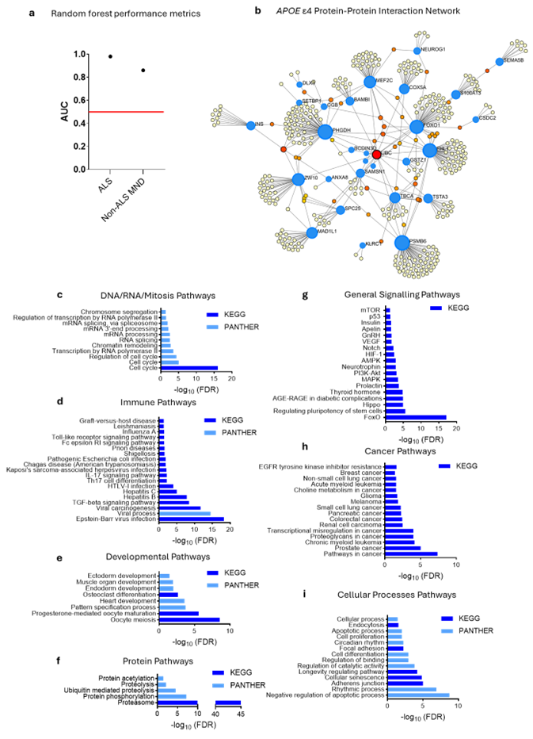

### _APOE ε4 defines a systemic immune endophenotype independent of clinical trajectory in amyotrophic lateral sclerosis_
This repository contains source code for the paper titled **_APOE ε4 defines a systemic immune endophenotype independent of clinical trajectory in amyotrophic lateral sclerosis_** (bioRxiv;https://www.biorxiv.org/content/10.64898/2026.02.02.703399v1.abstract). Using the Answer ALS cohort, this study aimed to test whether APOE ε4 influences ALS clinical trajectories or motor neuron multiomics, and whether it defines a plasma proteomic endophenotype with relevance to disease progression.
#### SNAPSHOT OF THE RESEARCH
**Data and Participants:** Using multiomic and longitudinal clinical data from **Answer ALS** (n = 934; 99 non-impaired controls, 774 ALS, 61 non-ALS MND), we evaluated the biological relevance of APOE ε4 in ALS by testing whether ε4 status modifies clinical trajectories (ALSFRS-R over >3 visits, with CNS-LS and ALS-CBS), shapes iPSC-derived motor neuron molecular profiles, and/or defines a distinct systemic plasma proteomic endophenotype. Participants were recruited across multiple U.S. neuromuscular centers. Controls and ALS cases were similar in age (55+14 vs 55+11 years) while non-ALS MND cases were older (62+12), and APOE genotypes were dominated by ε3/ε3 with ε4 carriage ~23–27% (ε4/ε4 rare). APOE genotype was called from WGS by extracting rs429358/rs7412, assigning ε2/ε3/ε4 alleles, and defining ε4 carriers (ε2/ε4, ε3/ε4, ε4/ε4) versus non-carriers as the binary exposure for downstream analyses.

**Methods:** We tested genotype effects across (1) longitudinal clinical outcomes (ALSFRS-R, ALS-CBS, CNS-LS) using linear mixed-effects models with fixed effects for time, APOE ε4 status, and their interaction (adjusting for age/sex; random intercepts and (where supported) random slopes), (2) patient iPSC-derived motor-neuron multiomics (ATAC-seq, bulk RNA-seq, and label-free proteomics) after QC filtering, variance-stabilization/log2 transformation, and limma-based batch adjustment, followed by limma differential analyses and supervised random-forest classification with mutual-information feature selection performed on training folds only under repeated cross-validation with within-fold upsampling, and (3) baseline plasma SomaScan v4.1 proteomics (RFUs) where APOE ε4-associated proteins were identified via mutual information in controls, evaluated via random-forest models transferred to ALS and non-ALS MND groups, and then interpreted biologically via NetworkAnalyst-driven PPI and pathway enrichment (IMEx/PANTHER/KEGG, plus DrugBank interactions).

**Results:** APOE ε4 carriage did not meaningfully alter ALS clinical trajectories and showed little to no effect on molecular profiles in patient iPSC-derived motor neurons across chromatin, transcriptomic, and proteomic layers. In contrast, plasma proteomics revealed a robust APOE ε4-associated immune-enriched signature that was stable across visits and accurately distinguished carriers from non-carriers in ALS and related MND (Fig. 1). Within this systemic signature, a small set of proteins showed longitudinal changes that tracked faster functional decline and enabled construction of a composite score that captured progression rate independent of APOE ε4 itself.

_**Figure 1.**_ _Plasma proteomic profiling reveals an APOE ε4-associated immune and inflammatory signature in ALS. (a) Performance of random forest classifiers demonstrates strong discrimination of APOE ε4 status using plasma proteomic features in ALS and non-ALS motor neuron disease (MND) participants; the red line indicates chance performance (AUC = 0.50). (b) Protein-protein interaction network of APOE ε4 plasma proteins, highlighting extensive interconnectivity. Blue nodes represent identified APOE ε4 proteins; red, orange, and yellow nodes indicate connected imputed downstream proteins, with colour denoting the degree of interconnection (red > orange > yellow). (c-i) Functional enrichment analysis of APOE ε4 plasma proteins (FDR < 0.05) showing over-representation of (c) DNA/RNA/mitotic processes, (d) immune pathways, (e) developmental processes, (f) protein-related pathways, (g) general signalling, (h) cancer-related pathways, and (i) cellular processes._

**Conclusion:** The data indicate that APOE ε4 is not a major modifier of ALS clinical course or motor neuron-intrinsic molecular state, but instead defines a stable, systemic, immune-skewed plasma endophenotype that is detectable across diagnostic groups and persists over time. This suggests APOE ε4 contributes to ALS biology primarily through peripheral or whole-body pathways rather than by directly reprogramming motor neurons, and that genotype-linked plasma signatures can reveal biologically meaningful substructure even when they do not stratify conventional clinical trajectories.

